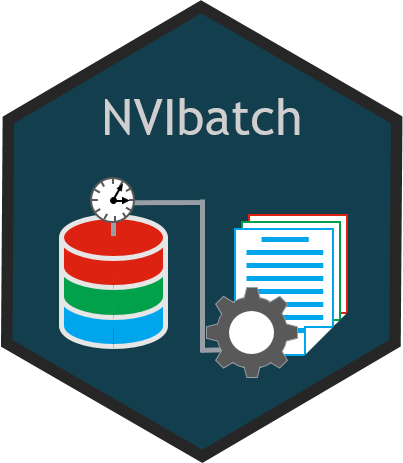

# NVIbatch: Tools to facilitate the running of R-scripts in batch mode at NVI 

<!-- README.md is generated from README.Rmd. Please edit that file -->

-   [Overview](#overview)
-   [Installation](#installation)
-   [Usage](#usage)
-   [Copyright and license](#copyright-and-license)
-   [Contributing](#contributing)

## Overview

`NVIbatch` provides tools to facilitate the writing of batch R-scripts
that should be run automatically at specific times.

`NVIbatch` is part of `NVIverse`, a collection of R-packages with tools
to facilitate data management and data reporting at the Norwegian
Veterinary Institute (NVI). The `NVIverse` consists of the following
packages: `NVIconfig`, `NVIdb`, `NVIspatial`, `NVIpretty`, `NVIbatch`,
`OKplan`, `OKcheck`, `NVIcheckmate`, `NVIpackager`, `NVIrpackages`. See
[Contribute to
NVIbatch](https://github.com/NorwegianVeterinaryInstitute/NVIbatch/blob/main/CONTRIBUTING.md)
for more information.

## Installation

`NVIbatch` is available at
[GitHub](https://github.com/NorwegianVeterinaryInstitute). To install
`NVIbatch` you will need:

-   R version > 4.0.0
-   R package `remotes`
-   Rtools 4.0 or Rtools 4.2 depending on R version

First install and attach the `remotes` package.

    install.packages("remotes")
    library(remotes)

To install (or update) the `NVIbatch` package, run the following code:

    remotes::install_github("NorwegianVeterinaryInstitute/NVIbatch",
        upgrade = FALSE,
        build = TRUE,
        build_vignettes = TRUE)

## Usage

The `NVIbatch` package needs to be attached.

    library(NVIbatch)

`NVIbatch` provides tools to facilitate the writing of batch R-scripts
that should be run automatically at specific times. The vignette “Run R
scripts automatically” gives a detailed description on how you can set
up an automatic batch job to run an R script on Windows.

The full list of all available functions and datasets can be accessed by
typing

    help(package = "NVIbatch")

Please check the NEWS for information on new features, bug fixes and
other changes.

## Copyright and license

Copyright (c) 2021 - 2022 Norwegian Veterinary Institute.  
Licensed under the BSD\_3\_clause License. See
[License](https://github.com/NorwegianVeterinaryInstitute/NVIbatch/blob/main/LICENSE)
for details.

## Contributing

Contributions to develop `NVIbatch` is highly appreciated. There are
several ways you can contribute to this project: ask a question, propose
an idea, report a bug, improve the documentation, or contribute code.
See [Contribute to
NVIbatch](https://github.com/NorwegianVeterinaryInstitute/NVIbatch/blob/main/CONTRIBUTING.md)
for more information.

------------------------------------------------------------------------

<!-- Code of conduct -->

Please note that the NVIbatch project is released with a [Contributor
Code of
Conduct](https://github.com/NorwegianVeterinaryInstitute/NVIbatch/blob/main/CODE_OF_CONDUCT.md).
By contributing to this project, you agree to abide by its terms.
